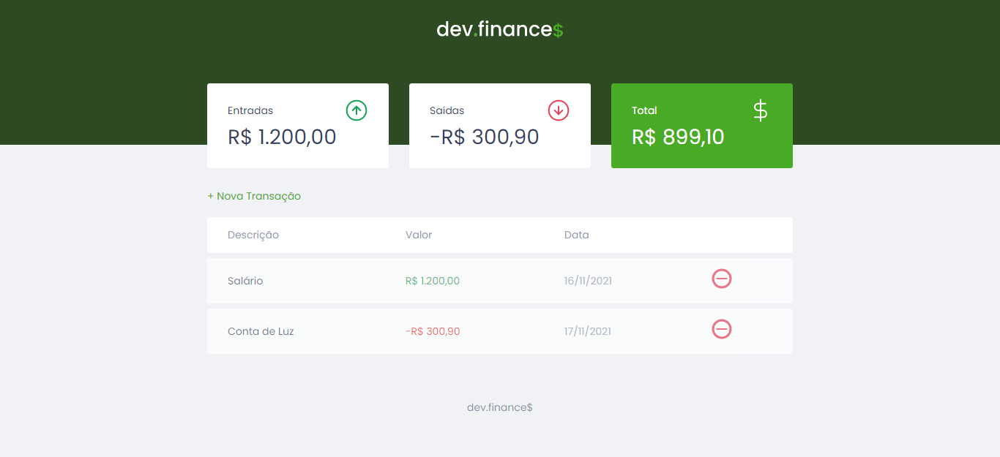
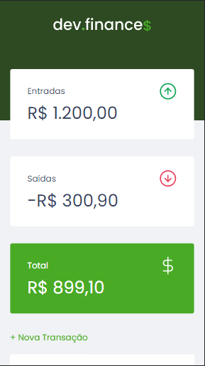
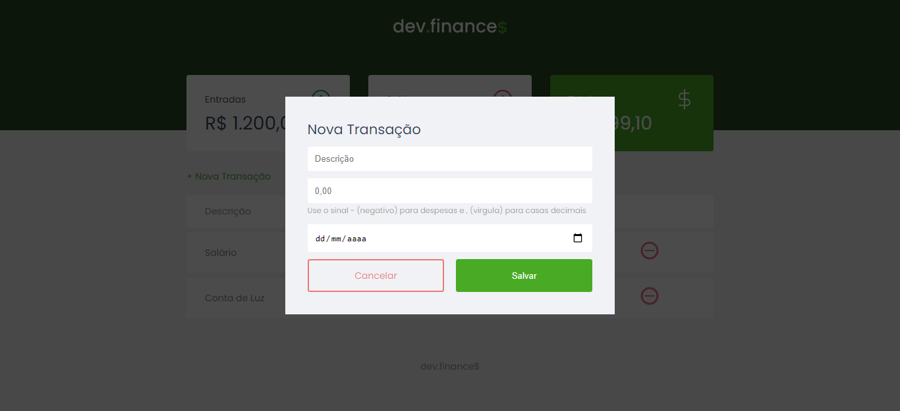

<h1 align="center">App Orçamento Pessoal 📃</h1>

## Sobre o desenvolvimento 🔍
Projeto feito para fins didáticos e prática da linguagem JavaScript. O desenvolvimento desse projeto foi feito usando as tecnologias:

### Tecnologias: <h3> 
* HTML
* CSS - Criação de estilos e costumizações.

### Linguagem de programação: <h3>
* JavaScript - Programar o app atráves de scripts externos.

>Observações: O foco deste projeto foi o treinamento e prática da linguagem JavaScript.

## Sobre o App 💻

O seu objetivo é claro, este app é uma interface para gerenciar suas financias, com um card com o calculo dos gastos (saidas), um card para o calculo das entradas e por ultimo um card para o calculo do total.

Ao cliclar em '*nova transação*', será exibido um modal com campos de: descrição, valor e data a ser preenchidos, para o cadastramento de uma nova transação.

O banco de dados utilizado é o localStorage, no qual é armazenado as transações.

A sua interface é apresentada de uma maneira simples pôrem dinamica e de boa visualização, para que seja de facil absorção para com os usuários.

## Previews

    

    

    

    

